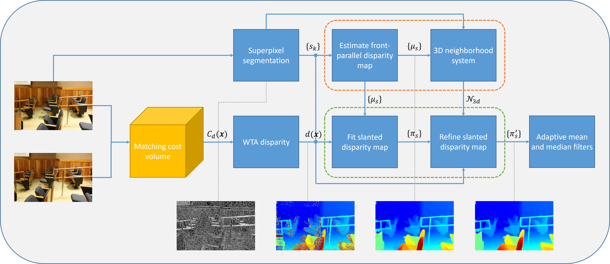

# Segment-based Disparity Refinement with Occlusion Handling for Stereo Matching
Please cite the [[paper](https://ieeexplore.ieee.org/document/8661596)] if you find it useful
```
@ARTICLE{8661596, 
author={T. {Yan} and Y. {Gan} and Z. {Xia} and Q. {Zhao}}, 
journal={IEEE Transactions on Image Processing}, 
title={Segment-Based Disparity Refinement With Occlusion Handling for Stereo Matching}, 
year={2019}, 
volume={28}, 
number={8}, 
pages={3885-3897}, 
doi={10.1109/TIP.2019.2903318}, 
ISSN={1057-7149}, 
month={Aug},}
```
# Workflow

# Dependency
-OpenCV 3  
-Eigen
# Usage
```
mkdir build
cd build
- on Windows:
  cmake .. -G "Visual Studio 15 2017 Win64" -T host=x64
  open and compile fdr.sln using Visual Studio 2017
- on Mac & Ubuntu:
  cmake ..
  make -j4
```
To run the demo
- on Windows:  
  double-click demo.bat
- on Mac & Ubuntu:  
  ./demo.sh  
## 
You will obtain the same results as in our paper on Windows. Results on Mac is silghtly different due to the graph-based segmentation generates different number of superpixels on Mac and Windows.
